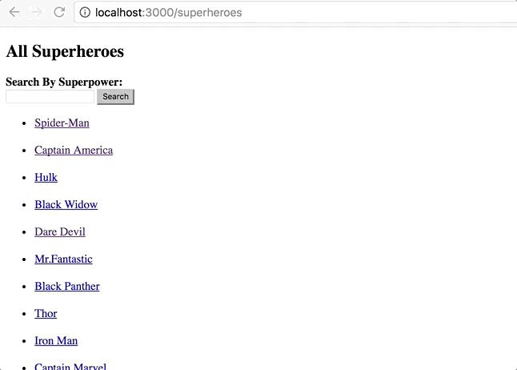
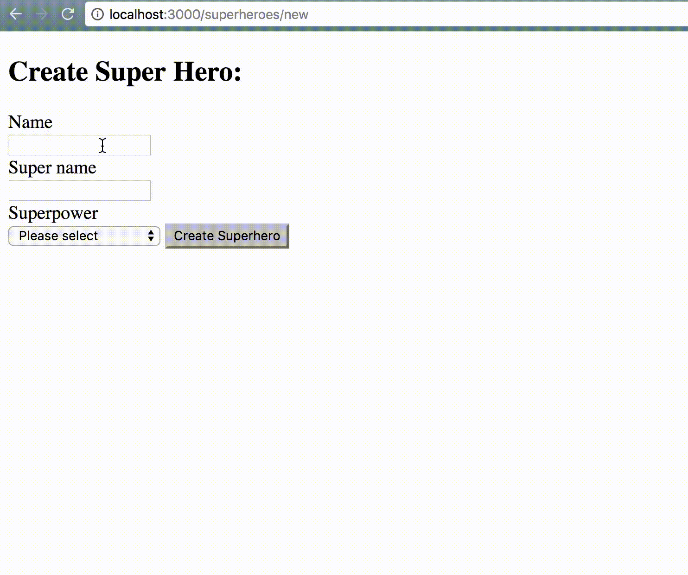
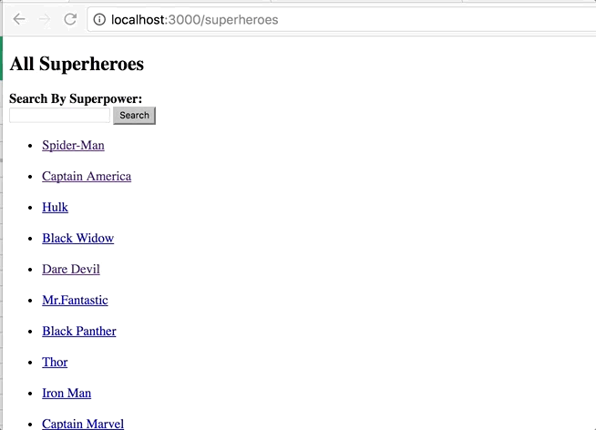

# Rails Code Challenge

It's time to put our Rails know-how to the test. Today, we have a superhero application.

## Objectives
+ MVC
+ REST
+ Request/Response Cycle
+ Form/Form Helpers
+ ActiveRecord
+ Validations

## Setup

Before you begin, fork and clone this repo, run `bundle install` and `rake db:migrate` to get started.

## The Domain

You've just been hired by 'Marvel Comics' - congratulations! The production staff wants you to make a website that will allow the fans to create superheroes. To do this, we need a way to keep track of all of the new superheroes and superpowers that have been created by the fans.

Luckily, another developer has already started the job. We have a model for superheroes and a model for superpowers. Once the database is seeded, visiting `/superheroes` displays all of the superheroes, and visiting `/superpowers` displays all of the superpowers. We just don't have a way to associate superheroes with superpowers.

We have several different superpowers and each can be bestowed upon **more than one superhero**. Each superhero can only wield **one superpower**.

## Instructions / Deliverables

Read through the instructions to get a sense of the scope of this code challenge, and then tackle them one by one. 

1. Create the associations between models. You may have to alter the current schema to get your code working. If you've set up your relationships properly, you should be able to run `rake db:seed` without errors, and confirm in console that the superheroes and powers have been created with the proper relations.

2. On the superheroes index page, a superhero's name should link to the superhero's show page.

3. The superhero show page should include the superhero's name (eg. Peter Parker), its super name (eg. Spider-Man), and its superpower. The superpower should link to the superpower show page.  

4. The superpower show page should have its name and description.

5. As a visitor to the website, I should be able to create a new superhero with its name and super name.

6. The form should also allow each superhero should be created with **only one of the existing superpowers**.

  

7. Make sure no two superheroes have the same super name.

8. Add a filter to the index view of the superheroes. This will allow the visitor to search for an existing superpower and display all the superheroes with that superpower on the same view page.

### Hints / Tips
+ Draw your domain model and associations before you begin. You may have to alter the current schema to get your code working.
+ A child model cannot be persisted without being associated with its parent model.
+ More than one superhero can have the same superpower.
+ We want to be RESTful. What URL should show info about a particular superhero? What URL should show a form to create a superhero? What controller actions are associated?
+ If you're having a hard time implementing the filter, take a look at this http://guides.rubyonrails.org/form_helpers.html#a-generic-search-form. We are asking an input field to search for superpowers.
