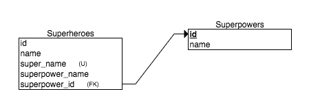

# Rails Superhero Challenge

###How to Run
* clone from Github repo
* type `bundle exec rake db:migrate`
* type `bundle exec rake db:seed`
* type `rails s` to start the Rails server
* navigate to localhost:3000 to view the application

### Features
* view superheroes' names, super names, and superpowers
* view superpowers and descriptions
* create a new superhero (no duplicate super names)
* search by superpower

## Objectives
+ MVC - done
+ REST - done 
+ Request/Response Cycle - done
+ Form/Form Helpers - done*
+ ActiveRecord - done
+ Validations - done

*one bug remaining: for newly-created superheroes, the superpower name on the 'show' page does not display properly

## Learning about Rails applications
Learning the basics of a Rails application can look daunting, but the implementation is often easier than it looks! The main features of a Rails app include:

### MVC

MVC stands for "model - view - controller", and it is the governing principle of how we view Rails applications. It is a pattern used to divide applications into three distinct parts that all interact with each other.
* model: manages the data, logic, and rules of the application
* view: think of a view as the part that the user sees on the page.
* controller: accepts input and puts it into commands.
This app has models, views, and controllers for Superheroes and Superpowers.

### REST

REST: When we build Rails apps, we build apps that are "RESTful" in nature. REST stands for representation state transfer. If you're learning about REST for the first time, try to keep the following things in mind:
* RESTFUL applications are lightweight, maintainable, and scalable.

## Tasks

### ERD Diagram

### Task 1 - Solving the Associations
New associations need to be created between the two tables - Superheroes and Superpowers. Using the "rails g migration" command, I added two new columns to superheroes, powerpower_id (integer) and superpower_name (string).
I also added new seeds to the exisiting seeds.rb file so that the tables could repopulate with the relevant data.

### Task 2 - Linking Superhero Show page
On the superheroes index page, I linked the superhero's name to the individual show page.

### Task 3 - Superhero Show page
The superhero show page includes the superhero's name, superhero name, and superpower. The superpower should link to the relevant superpower show page.

### Task 4 - Superpower show page
The superpower show page has a name and a description

### Task 5 - Create new Superhero
Visitors to the site can create a new superhero with a name and super name. You can access this page by going to localhost:3000/superheroes and scrolling down to the bottom of the page.

### Task 6 - Existing Superpowers
The form only allows a new superhero to be created with an existing superpower.

### Task 7 - Unique Super Name
No two superheroes can have the same name. Attempting to create a superhero with a duplicate super name will lead to a page advising the user to try again.

### Task 8 - Superpower Search Filter
Visitors can search for superheroes by superpower. On localhost:3000/superheroes, there is a search form that allows users to type in the superpower they want to search for. The search will return superheroes who have that particular superpower.